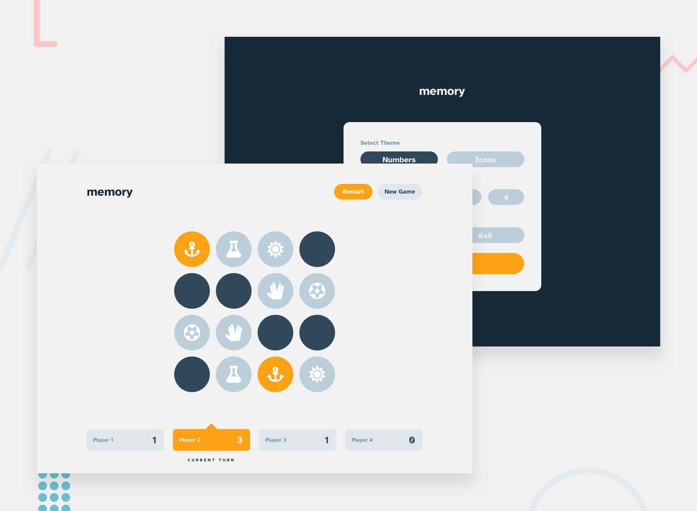

# Frontend Mentor - Memory game

Users should be able to:

- View the optimal layout for the game depending on their device's screen size
- See hover states for all interactive elements on the page
- Play the Memory game either solo or multiplayer (up to 4 players)
- Set the theme to use numbers or icons within the tiles
- Choose to play on either a 6x6 or 4x4 grid

## The solution

- [Live Site URL](https://main--frolicking-concha-74bf4e.netlify.app/)

### Built with

- [React](https://reactjs.org/) - JS library

### What I learned

I've been super lucky in that I'm one of the early testers on [Josh Comeau's Joy of React course](https://www.joyofreact.com/), and I wanted to apply what I had learnt in some unguided practice. I've been through the course a couple of times now and find in to be really, really good. I used CSS modules and prefer this approach to styled componets as it seems to allow me to take advantage of the cascade and CSS custom properties, and also allow for the scoping of CSS class names. I used React context again in this challenge, and found it really simplified my app structure. I also incorporated a few custom hooks into this one!

### Where I got stuck

- It tool me a while to work out how to get the CSS to work the way I wanted to, with some global utilities and compositional classes, customisation with the cascade and custom properties. I think I arrived at a good place but it took me longer than I had anticipated.

### Resources

- [Josh Comeau's Joy of React course](https://www.joyofreact.com/)

### Continued development

I'd like to keep pushing on with React, but need to step up my learning to some additional concepts as I am now pushing up against the edge of what I've learned to date. I'm keen to have a go with Next.js next

## Author

- [Personal Website](https://www.dwhenson.com)
- Frontend Mentor Profile - [@dwhenson](https://www.frontendmentor.io/profile/dwhenson)
